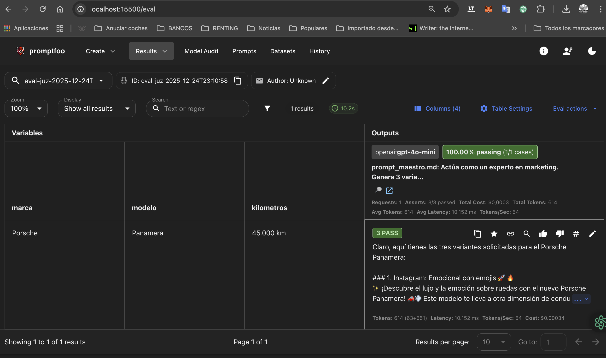

# 🚀 Módulo 2: Generación Multicanal de Anuncios

Sistema de generación automatizada de copy publicitario diseñado para escalar la visibilidad de un stock de **+600 vehículos**. Este motor transforma datos técnicos en anuncios persuasivos optimizados para diferentes canales.

## 🛠️ Stack Tecnológico
* **Motor:** OpenAI GPT-4o-mini.
* **Validación:** Promptfoo (Testing automatizado de tono y coherencia).
* **Control de versiones:** Git & GitHub.

## ✅ Evidencias de Éxito y Validación

El sistema ha sido testeado exhaustivamente para garantizar que la generación multicanal cumple con los requisitos de marca y formato.

### 1. Validación Técnica (Terminal)
Se han ejecutado tests automatizados con **Promptfoo** asegurando que el modelo GPT-4o-mini responde correctamente a las variables de stock (Porsche Panamera).

### 2. Resultado Multicanal (Vista de Usuario)
Interfaz de resultados donde se observa el cumplimiento de las 3 variantes solicitadas y las aserciones de tono (emojis para Instagram y enfoque profesional).

> **Nota:** El sistema valida automáticamente la presencia de elementos de engagement (🚀🔥) y la coherencia de los datos técnicos (45.000 km).

## 🧠 Capacidades del Motor
El prompt maestro genera automáticamente 3 variantes:
1. **Instagram:** Enfoque emocional y estilo de vida con emojis.
2. **Facebook Marketplace:** Enfoque funcional y técnico.
3. **LinkedIn:** Tono profesional enfocado a eficiencia empresarial.
---

## 📩 Contacto e Integración
Este módulo es una pieza fundamental del **Ecosistema de Gestión de Stock (+600 vehículos)**. Puedes ver la implementación completa y el dashboard de control en mi espacio de trabajo:

🔗 **[Ver Dashboard en Notion] (https://heavenly-brownie-8e2.notion.site/Proyecto-2-Generaci-n-Multicanal-de-Anuncios-Porsche-Panamera-2d3c6facf09080cc8ef2ee5f548f7d6f**)

---
*Proyecto desarrollado por Ricardo Rubio Albacete*